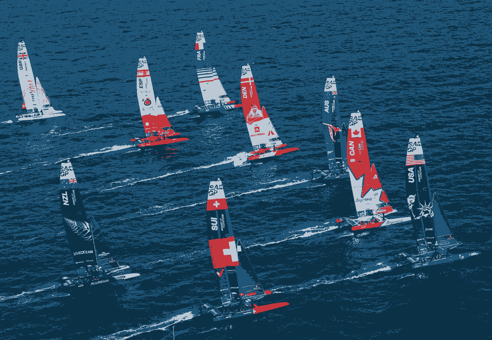
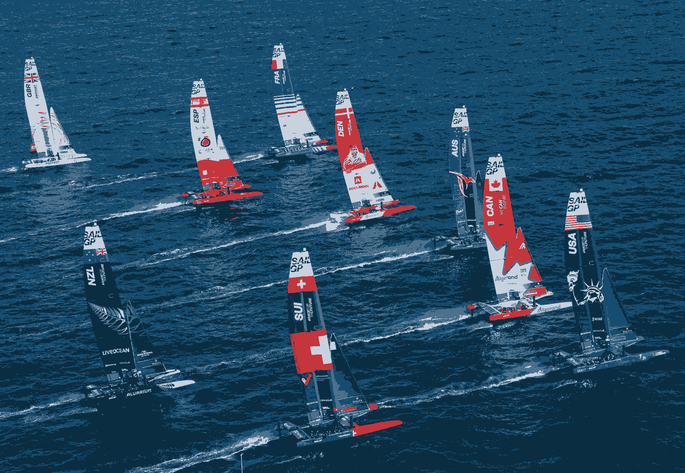
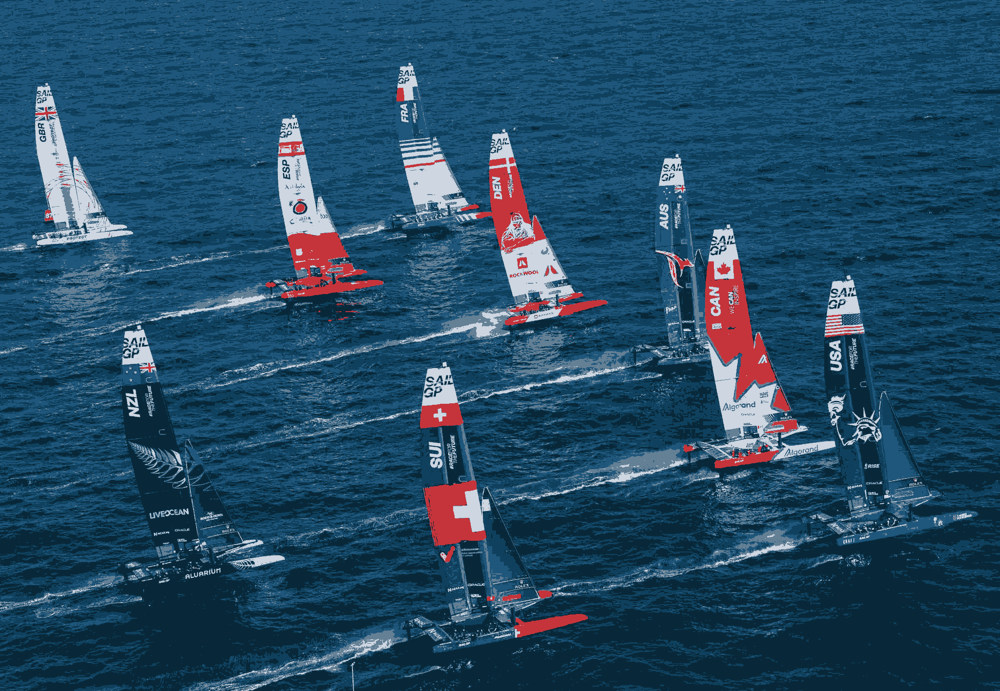
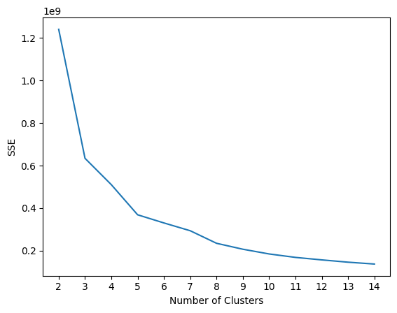
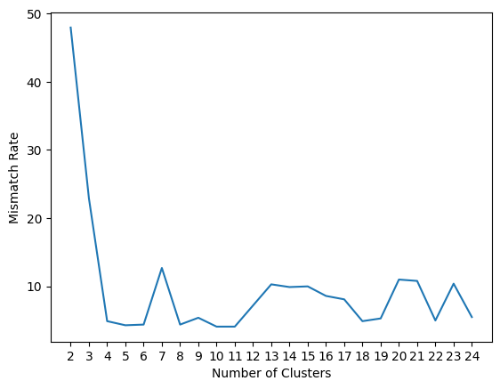
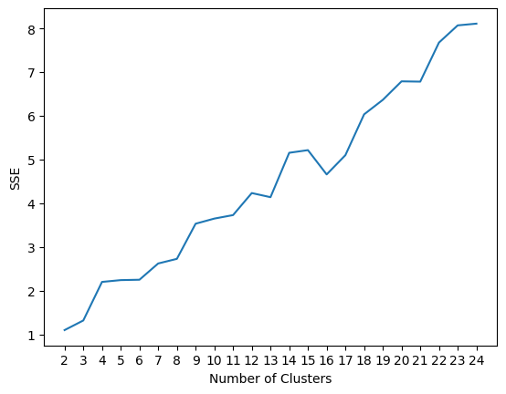

```{r setup, include=FALSE}
knitr::opts_chunk$set(echo = TRUE)
```

# 1 Concept Questions

## 1. What’s the main difference between supervised and unsupervised learning? Give one benefit and drawback for supervised and unsupervised learning, respectively.

  The main difference between supervised and unsupervised learning is that supervised learning requires a labeled dataset. The goal is to map inputs to outputs and each datapoint has a target. Supervised learning is capable of producing accurate prediciton models given labeled dataset, but its drawback is the need for labeled data. Labeled data is not always accessible. On the other hand, unsupervised learnign does not require labeled data. These algoritms try to find patterns and groupings within the given data. The lack of labeled data allows for the ability to find hidden patterns in data but the results are then difficult to interpert and connect to real world applications. 
    

## 2. Will different initializations for k-means lead to different results?

  Yes, k-means minimizes the objective function which can contain local minima. Also the initial centrodis are randomly determined which can lead to the obejctive function converging to different local minima. 


## 3. Give a short proof (can be in words but using correct logic) of why k-means algorithm will converge in a finite number of iterations.

  The k-means algorithm will converge in a finite number of iterations because the algorithm minimizes the WCSS and will only iterate of it deceases. Given a finite set of data points, there is a finite number of ways to assign the data to clusters. Each iteration, the WCSS will decrease or not change. If the WCSS can not increase, and there are finite cluster groups, the algorithm will converge in a finite number of iterations.


## 4. What is the main difference between k-means and generalized k-means algorithm? Explain how the choice of similarity/dissimilarity/distance will impact the result.

  K-Means uses the Euclidean distance to determine the similarity and distance of the data and centers. The Euclidean distance is a good measure when the clusters are spherical and generally equally sized. Generalized K-Means allows for various distance metrics to be used. The choice of distance metric will impact the results. Based on the characteristics of the data, other distance metrics will be better. The Manhattan distance is another metric that is useful when the data has different scales.
    

## 5. Write down the graph Laplacian matrix and find the eigenvectors associated with the zero eigenval- ues. Explain how you find out the number of disconnected clusters in the graph and identify these disconnected clusters using these eigenvectors.


$A = \begin{bmatrix} 0 & 1 & 1 & 0 & 0 \\ 1 & 0 & 1 & 0 & 0 \\ 1 & 1 & 0 & 0 & 0 \\ 0 & 0 & 0 & 0 & 1 \\ 0 & 0 & 0 & 1 & 0 \end{bmatrix}$

$D = \begin{bmatrix} 2 & 0 & 0 & 0 & 0 \\ 0 & 2 & 0 & 0 & 0 \\ 0 & 0 & 2 & 0 & 0 \\ 0 & 0 & 0 & 1 & 0 \\ 0 & 0 & 0 & 0 & 1 \end{bmatrix}$

$L = D-A =\begin{bmatrix} 2 & -1 & -1 & 0 & 0 \\ -1 & 2 & -1 & 0 & 0 \\ -1 & -1 & 2 & 0 & 0 \\ 0 & 0 & 0 & 1 & -1 \\ 0 & 0 & 0 & -1 & 1 \end{bmatrix}$
So that $L*v=0$
$v_1 = \begin{bmatrix} 1  \\ 1  \\ 1  \\ 0  \\  0  \end{bmatrix}$
$v_2 = \begin{bmatrix} 0  \\ 0  \\ 0  \\ 1  \\  1  \end{bmatrix}$


# 2 Math of K-Means Clustering

## 1.
Given: $J = \sum_i \sum_j r_{ij} \cdot \lVert x_i - \mu_j \rVert^2$


$\frac{\partial J}{\partial \mu_j} = \frac{\partial}{\partial \mu_j} \left(\sum_i \sum_j r_{ij} \cdot \lVert x_i - \mu_j \rVert^2\right) = 2 \sum_i r_{ij} \cdot (x_i - \mu_j)$


$0 = 2 \sum_i r_{ij} \cdot (x_i - \mu_j)$

Solve for $\mu_j$:


$\mu_j = \frac{1}{\sum_i r_{ij}} \sum_i r_{ij} \cdot x_i$

## 2.

Given: $J = \sum_i \sum_j r_{ij} \cdot \lVert x_i - \mu_j \rVert^2$


$\frac{\partial J}{\partial r_{ij}} = \frac{\partial}{\partial r_{ij}} \left(\sum_i \sum_j r_{ij} \cdot \lVert x_i - \mu_j \rVert^2\right) = 2 \lVert x_i - \mu_j \rVert^2$


$0 = 2 \lVert x_i - \mu_j \rVert^2$

Solve for $r_{ij}$:

$\lVert x_i - \mu_j \rVert^2 = 0$


$r_{ij} = \begin{cases} 1, & \text{if } j = \arg\min_{k} \lVert x_i - \mu_k \rVert^2 \\ 0, & \text{otherwise} \end{cases}$

When the centroids $\mu_j$ are fixed, $r_{ij}$ should be set to 1 for the cluster $j$ that minimizes the squared Euclidean distance and set to 0 for all other clusters. 


# 3 Image Compression using Clustering

## 1. 

### Football Image compression for k={2,6}
{width=50%}
{width=50%}
{width=50%}
{width=50%}
{width=50%}

### Hestain Image compression for k={2,6}
{width=50%}
{width=50%}
{width=50%}
{width=50%}
{width=50%}

### Sailing Image compression for k={2,6}
{width=50%}
{width=50%}
{width=50%}
{width=50%}
{width=50%}
\newpage

## 2. 
```{r Q2 a, echo=FALSE}
#df = data.frame()
library(kableExtra)
library(knitr)

#out = c(0.94, 32,32,32,32)
#df$test  = out

df=data.frame(Clusters=c(2,3,4,5,6),
              Iterations=c(18,15,26,31,32),
              RunTime=c(0.94,1.11,2.63,2.87,3.52))

df1=data.frame(Clusters=c(2,3,4,5,6),
              Iterations=c(7,24,32,61,57),
              RunTime=c(0.104,0.412,0.637,1.48,1.67))

df2=data.frame(Clusters=c(2,3,4,5,6),
              Iterations=c(20,20,37,67,48),
              RunTime=c(15.77,18.77,50.77,94.63,88.72))

kable(df,"latex",align="c", caption="Football Image Results",label="Q2",escape = FALSE)%>%
    kable_styling(latex_options = "hold_position")

kable(df1,"latex",align="c", caption="Hestain Image Results",label="Q2",escape = FALSE)%>%
    kable_styling(latex_options = "hold_position")

kable(df2,"latex",align="c", caption="Sailing Image Results",label="Q2",escape = FALSE)%>%
    kable_styling(latex_options = "hold_position")

```


\newpage


## 3. 

One method of finding the best k for k-means is utilizing the elbow plot. The elbow plot has varying k values on the x-axis and the Within-Cluster Sum of Squares (WCSS) value for each k on the y-axis. The WCSS calculates the variance within each cluster. The aim of the plot is to see when the addition of additional clusters has diminishing improvements in the WCSS. Usually, an elbow, is observed, and that is where the rate of decrease in WCSS diminishes. The elbow plot method is a subjective method and is a helpful heuristic. Depending on the dataset, there can be no distinct 'elbow' in the plot. 

The example below is for the Football image. With additional clusters, the WCSS decreases, but after about 5 clusters, the rate of decrease is much less apparent than with the addition of the first 4 clusters. Based on this plot, the optimal k value would be 5. 

{width=50%}

# 4 MNIST Dataset Clustering

```{r Q3, echo=FALSE}

library(kableExtra)
library(knitr)


df=data.frame(Cluster=c(1,2,3,4,5,6,7,8,9,10),
              Purity=c(0.789,0.550,0.703,0.634,0.374,0.337,0.775,0.450,0.530,0.415))

df1=data.frame(Cluster=c(1,2,3,4,5,6,7,8,9,10),
              Purity=c(0.418,0.997,0.441,0.432,0.436,0.352,0.601,0.683,0.394,0.518))

kable(df,"latex",align="c", caption="Purity Scores for Euclidean Distance Metric",label="Q2",escape = FALSE)%>%
    kable_styling(latex_options = "hold_position")

kable(df1,"latex",align="c", caption="Purity Scores fot Manhattan Distance Metric",label="Q2",escape = FALSE)%>%
    kable_styling(latex_options = "hold_position")


```

It seems that the best purity scores came from using the Manhattan distance. The data processed was image data represented in pixel form. Manhattan distance restricts the metric to vertical and horizontal directions. This may have aided in getting better results in its image analysis. 

# 5 Political Blog Dataset
## 1.
```{r Q5, echo=FALSE}

library(kableExtra)
library(knitr)


df=data.frame(Cluster=c(1,2),
              MajorityLabel=c(1,1),
              MismatchRate=c(0.481,0.0))

df1=data.frame(Cluster=c(1,2,3,4,5),
              MajorityLabel=c(1,0,0,1,1),
              MismatchRate=c(0.067,0.0,0.021,0.0,0.0))

df2=data.frame(Cluster=c(1,2,3,4,5,6,7,8,9,10),
              MajorityLabel=c(0,0,1,0,0,0,1,1,1,0),
              MismatchRate=c(0.0,0.022,0.0,0.0,0.0,0.0,0.0,0.0,0.070,0.0))

df3=data.frame(Cluster=c(1,2,3,4,5,6,7,8,9,10,11,12,13,14,15,16,17,18,19,20,21,22,23,24,25),
              MajorityLabel=c(1,0,0,0,1,0,0,1,1,0,0,0,0,0,0,0,0,0,1,1,0,0,0,0,0),
              MismatchRate=c(0.028,0.0,0.477,0.0,0.0,0.0,0.0,0.0,0.0,0.0,0.0,0.25,0.0,0.166,0.0,0.0,0.0,0.0,0.0,0.034,0.0,0.066,0.0,0.409,0.111))

kable(df,"latex",align="c", caption="Purity Scores for Euclidean Distance Metric",label="Q2",escape = FALSE)%>%
    kable_styling(latex_options = "hold_position")

kable(df1,"latex",align="c", caption="Purity Scores fot Manhattan Distance Metric",label="Q2",escape = FALSE)%>%
    kable_styling(latex_options = "hold_position")

kable(df2,"latex",align="c", caption="Purity Scores fot Manhattan Distance Metric",label="Q2",escape = FALSE)%>%
    kable_styling(latex_options = "hold_position")
kable(df3,"latex",align="c", caption="Purity Scores fot Manhattan Distance Metric",label="Q2",escape = FALSE)%>%
    kable_styling(latex_options = "hold_position")

```


## 2. 

Looking at overall mismatch rate, it seems that additional clusters past 4 clusters do not help minimize it. The rate hovers between 4 and 10 %. The mismatch rate was high for 2 and 3 clusters but dropped signifigantly at 4 clusters.  Further, utilizing an elbow plot, it is observed that the WCSS increases consistently past 2 clusters. This implies that there are two to four distinct political communities in the dataset. 


{width=50%}
{width=50%}


