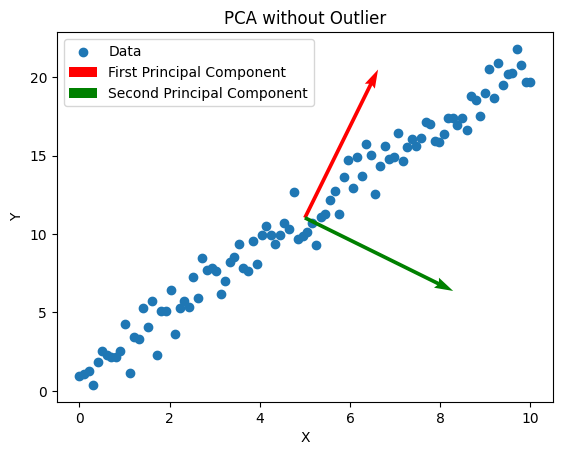

```{r setup, include=FALSE}
knitr::opts_chunk$set(echo = TRUE)
```

# 1. Conceptual questions

## 1. 


Given:

$$
J(w) = \frac{1}{m} \sum_{i=1}^{m} \left(w^T x_i - w^T \mu\right)^2 = \frac{1}{m} \sum_{i=1}^{m} \left(w^T (x_i - \mu)\right)^2 = w^T \left(\frac{1}{m} \sum_{i=1}^{m} (x_i - \mu)(x_i - \mu)^T\right) w = w^T Cw
$$


$$
L(w, \lambda) = w^T Sw - \lambda(1- ||w||^2)
$$

$$
\frac{\partial L}{\partial w} = 0 = 2Cw-2\lambda w \rightarrow Cw=\lambda w
$$


Principle component directions capture variance of the data. Given $w^T Cw$, the vector $w$ that maximizes this is the eignevector with the largest eigenvalue. Therefore, it also captures the direction where the data has the most variance, and corresponds to the first principle component direction.


## 2. 

To find the second principle component, would require finding the eigenvector with the second largest eigenvalue. Also, the first principle component can be subtracted from the data, and then the updated C matrix can be used to find the new first principle component of the 'new' dataset, which becomes the second principle component of the original data. 

## 3. 

Given:

$f(x;\mu,\sigma^2) = \frac{1}{\sqrt{2\pi\sigma^2}} e^{-\frac{(x-\mu)^2}{2\sigma^2}}$


$\mathcal{L}(\mu, \sigma^2; x_1, x_2, \ldots, x_m) = \prod_{i=1}^{m} \frac{1}{\sqrt{2\pi\sigma^2}} e^{-\frac{(x_i-\mu)^2}{2\sigma^2}}$


$\mathcal{L} = \ln \prod_{i=1}^{m} \frac{1}{\sqrt{2\pi\sigma^2}} e^{-\frac{(x_i-\mu)^2}{2\sigma^2}} = \sum_{i=1}^{m} \left(-\frac{1}{2}\ln(2\pi\sigma^2) - \frac{(x_i-\mu)^2}{2\sigma^2}\right) = -\frac{m}{2}\ln(2\pi\sigma^2) - \frac{1}{2\sigma^2} \sum_{i=1}^{m} (x_i-\mu)^2$

**MLE for \(\mu\):**


$\frac{\partial \ln\mathcal{L}}{\partial \mu} = \frac{1}{\sigma^2} \sum_{i=1}^{m} (x_i-\mu) = 0$

Solving for $\mu$:

$\sum_{i=1}^{m} (x_i-\mu) = \sum_{i=1}^{m} x_i - m\mu = 0$


$\therefore \mu = \frac{1}{m} \sum_{i=1}^{m} x_i$


**MLE for \(\sigma^2\):**


$\frac{\partial \ln\mathcal{L}}{\partial (\sigma^2)} = -\frac{m}{2\sigma^2} + \frac{1}{2(\sigma^2)^2} \sum_{i=1}^{m} (x_i-\mu)^2 = 0$

Solve for $\sigma^2$:

$-\frac{m}{2\sigma^2} + \frac{1}{2(\sigma^2)^2} \sum_{i=1}^{m} (x_i-\mu)^2 = 0 \rightarrow \frac{1}{2(\sigma^2)^2} \sum_{i=1}^{m} (x_i-\mu)^2 = \frac{m}{2\sigma^2}$


$\sum_{i=1}^{m} (x_i-\mu)^2 = m\sigma^2$
$\therefore \sigma^2 = \frac{1}{m} \sum_{i=1}^{m} (x_i-\mu)^2$


## 4.
 
ISOMAP utilizes 3 major concepts that are geodesic distances, neighborhood graphs, and Multi-Dimensional Scaling (MDS).

Neighborhood graphs capture each datapoints k-nearest neighbors based on euclidean distance and represents the geometry of the data locally. Also, the graph confirms that each datapoint can be reached along graph edges, confirming no isolated data clusters. Using this neighborhood graph, the shortest paths are generated between all pairs of points. This is done using Geodesic distances. 

Geodesic distances are the shortest distances along a manifold surface. This method of measuring distances allows for better capture of relationships between data points, and does not assume a straight line distance like Euclidean distance measurements. 

MDS attempts to take the high dimension geodesic distances and analyze them in a lower dimension while maintaining the original distances. This step allows for better insight into the data structure, patterns, and relationships. 

## 5.

Outliers greatly impact the PCA performance. Principle Components capture the variance of the data. So if there is an outlier it will affect how much variance the first PC can contain, and in turn how well it can represent the original data.
The example below illustrates this. The first image shows a dataset with a linear trend. The first PC captures over 99% of the data variance. The second image shows the same dataset but with one outlier data point. Now only ~93% of the datas variance is captured in the first PC. This shows the affect outliers can have on the effectiveness of PCA analysis


No Outlier Explained Variance Ratio: [0.99520214 0.00479786]

{width=50%}


Outlier Explained Variance Ratio: [0.93183656 0.06816344]


{width=50%}


\newpage


# 2. PCA: Food Consumption

## a. 
The data matrix is constructed so that each country is a row and each 'feature' food group is a column.It seems that the warmer climate countries tend to be grouped in the upper section of the plot, and the colder countries in the bottom portion of the plot. 

{width=50%}


## b.
The data matrix is constructed so that each food group is a row and each 'feature' country is a column. This plot has most of the foods grouped on the left portion of the plot with olive oil and garlic separate from the rest. All of the frozen and stable foods are all together and the more 'intense' flavor foods are further away. 

{width=50%}


\newpage


# 3. Order of faces using ISOMAP

## a.
{width=50%}

## b.
Looking at the scatter plot below, there seems to be a trend along both axis. The x-axis seems to track head positions turned left or right and the y-axis seems to track the heads tilt, either up or down. The images in the center of the data seem to be facing straight forward. This seems to track the papers findings as well, where each portion of the plot corresponds to a facial orientation and it tracks smoothly along the entire plot. 

{width=50%}


## c. 
Looking at the PCA results, a trend is not as clear or intuitive. There is no clear left/right or up/down relationship but more of a shadow/no shadow trend. The right side of the plot seems to group darker images while the left side has lighter images. There may be a slight left/right relationship along the y-axis but not enough to be reliable. 

ISOMAP shows a much more meaningful and useful projection of the faces. This may be because the facial image data can not be linearly reduced, which is an assumption in PCA. ISOMAP better captures the nonlinear relationships of facial data. PCA's sensitivity to outliers may also hinder the effectiveness of it when used in facial data analysis. 


{width=50%}


\newpage 


# 4. Eigenfaces and Facial Recognition

## a. 
It seems that the first few eignefaces capture the subjects with a neutral expression. Then the final eignefaces seem to capture different facial expressions such as smiling, or eyes closed. 


{width=100%}


{width=100%}


## b. 

Projection Residual for Subject 1 compared to Eigneface 1: 2.5551e-11
Projection Residual for Subject 2 compared to Eigneface 1: 2.8910e-11
Projection Residual for Subject 1 compared to Eigneface 2: 1.3831e-11
Projection Residual for Subject 2 compared to Eigneface 2: 1.5186e-11

For facial recognition algorithm to properly characterize faces, it compares eigenfaces to the test face. If there is a low projection residual, the face 'matches'. Looking at the observed residuals, it seems that the program can properly recognize subject 1 to its eigenface and reject subject 2. But, for eigenface 2, the wrong subject gets a lower residual and improperly characterizing the test face. 


## c.

My face algorithm does not seem to work all the time. One way to improve this is to increase the size of the dataset to get more datapoints, and improve the eigenfaces. Also, using PCA could be a limiting factor. Facial data is a nonlinear dataset, and using PCA requires it to find linear relationships that don't fully the data point relationships. 


\newpage


# 5. To subtract or not to subtract

$C=\frac{1}{m}\sum (x^i-\mu)(x^i-\mu)^T \\$
$\tilde{C} = \frac{1}{m} \sum x^i(x^i)^T\\$
$C=\frac{1}{m} \sum(x^i(x^i)^T - x^i \mu^T - \mu (x^i)^T + \mu \mu^T)= \tilde{C}- \frac{1}{m} \sum x^i \mu^T \sum \mu (x^i)^T \\$

$\frac{1}{m} \sum x^i \mu^T = \frac{1}{m}\sum \mu (x^i)^T = \mu\mu^T \\$

$\therefore C = \tilde{C}-2\mu \mu^T \\$

$Cw_i=\lambda w_i \rightarrow (\tilde{C}-2\mu \mu^T)w_i= \lambda w_i \rightarrow \tilde{C}w_i = w_i(\lambda+2\mu \mu^T) \\$

$\therefore w_i \ne\tilde{w_i}$

PCA is possible without mean centering the covariance matrix but this will lead to the first PC to be biased towards the mean of the data. Unless the mean is zero, subtracting the mean will lead to different $w_i$.


