```{r setup, include=FALSE}
knitr::opts_chunk$set(echo = TRUE)
```

# 1. Conceptual Questions

## 1.1
KDE and histograms are methods that estimate the PDF of a data set. KDE creates a smooth and continuous PDF. This is one advantage of KDE over histograms. KDE does not 'bin' data points. KDE utilizes a bandwidth that is adjusted to the data and this allows KDE to be very adaptable to various patterns. However, the choice of bandwidth can greatly impact the results. Too small of a bandwidth and the KDE can show patterns that are not representative of the data. Also, KDE is computationally intensive compared to histograms. Histograms are a quick and efficient way to represent data distribution. They show the frequency of data points in certain 'bins'. The choice of number and distribution of bins can alter the way the data distribution is viewed and can lose certain data patterns if the bins are too large. 


## 1.2 

Maximum Likelihood Estimation cannot be directly used to estimate GMM because there are unobserved latent variables and MLE requires maximization over all the variables. Also, MLE in GMM is usually non-convex and this can lead to convergence and sub optimal solutions for GMM.

Expectation-Maximization is better suited to estimate GMM. EM first step is to calculate the expected values of the latent variables which solves the issue that arises while using MLE to estimate GMM. 


## 1.3

$P(x) = \sum_{k=1}^{K} \pi_k \mathcal{N}(x|\mu_k \Sigma_k)$

Joint Distribution
$P(x,z) = \pi_z\mathcal{N}(x|\mu_z\Sigma_z)$

Marginal Distribution
$P(x)= \sum_{k=1}^{K}P(x,z)=\sum_{k=1}^{K}P(x|z)P(z)$

$l(\theta;D)=log\Pi_{i=1}^{m}(\sum_{k=1}^{K}P(x_i',z_i'=k|\theta))$

$\tau = \frac{p(x^i|z^i=k)(p(z^i=k)}{\sum p(z^i=k,x^i)}$

$\mathcal{N}(X|\mu, \Sigma)=\frac{1}{\sqrt{|\Sigma|}(2\pi)^{n/2}}exp{(\frac{1}{2}(X-\mu)^T\Sigma^{-1}(X-\mu))}$

$\tau = \frac{p(x^i|z^i=k)(p(z^i=k)}{\sum p(z^i=k,x^i)}=\frac{\pi_k \mathcal{N}(x^i|\mu_k, \Sigma_k)}{\sum_{k'}\pi_k' \mathcal{N}(x^i|\mu_k', \Sigma_k')}$


# 2. Density Estimation: Psychological Experiments

## 2.a

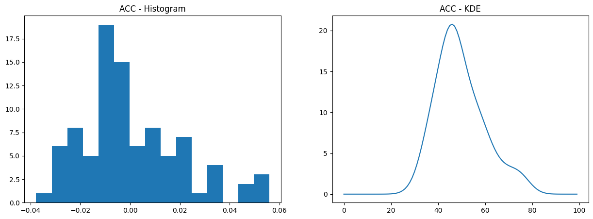{width=50%}

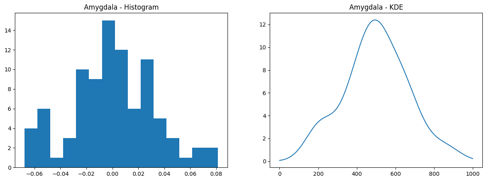{width=50%}

## 2.b

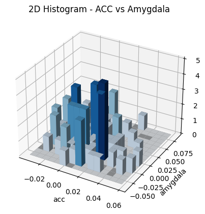{width=50%}


## 2.c

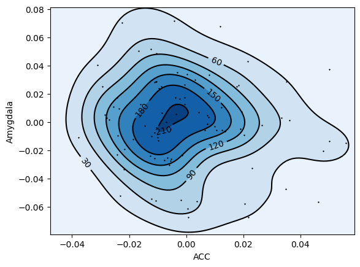{width=50%}

The data distribution is unimodal with a few outliers.

To determine if the two variables are independent, both Spearmans and Pearsons correlations were calculated and found to be -0.101 and -0.128 respectively. This shows that they are very likely to be independent but may have a slight relationship.

Spearmans correlation: -0.101

Pearsons correlation: -0.128


## 2.d

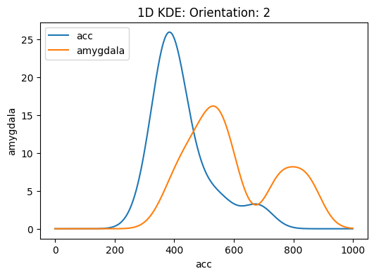{width=50%}
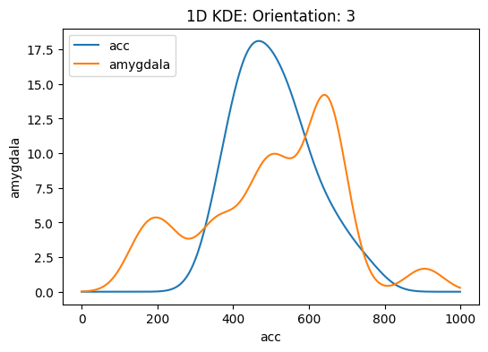{width=50%}
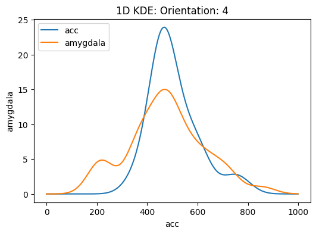{width=50%}
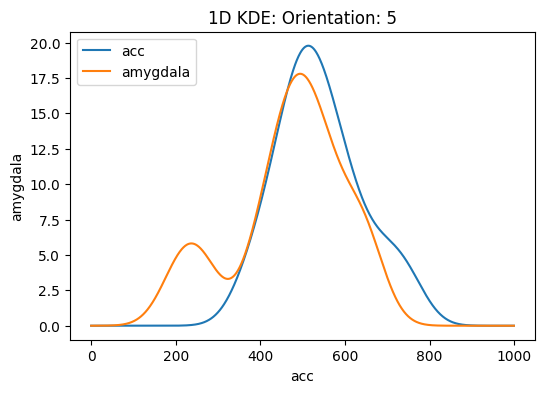{width=50%}

```{r Q2 a, echo=FALSE}
#df = data.frame()
library(kableExtra)
library(knitr)

#out = c(0.94, 32,32,32,32)
#df$test  = out

df=data.frame(Region=c('acc','amygdala'),
              'c2'=c(-0.0148,0.0191),
              'c3'=c(0.0017,0.0006),
              'c4'=c(0.0013,-0.047),
              'c5'=c(0.0081,-0.0057))


kable(df,"latex",align="c", caption="Conditional Sample Mean",label="Q3",escape = FALSE)%>%
    kable_styling(latex_options = "hold_position")

```

As the political orientation shifts from 2 to 5, or conservative to liberal, the mean ACC region volume increases, while the amygdala region volume decreases.


## 2.e

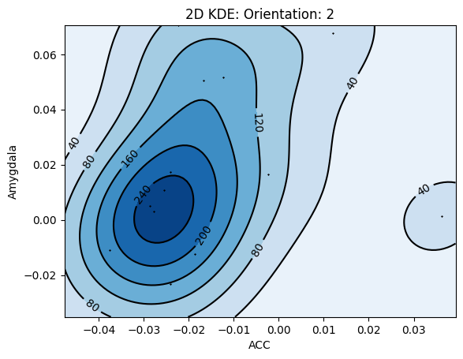{width=50%}
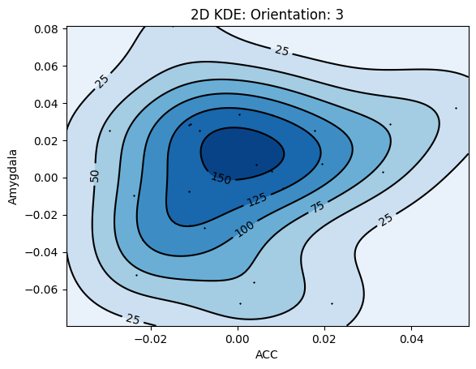{width=50%}
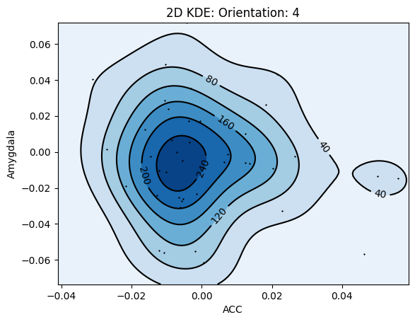{width=50%}
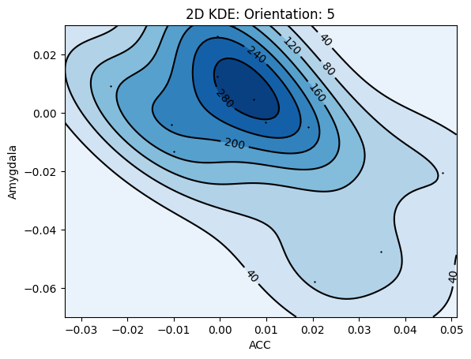{width=50%}
It is harder to infer a relationship between brain structure and political orientation based on the 2D KDE. 

# 3. Implementing EM for MNIST datset

## 3.a

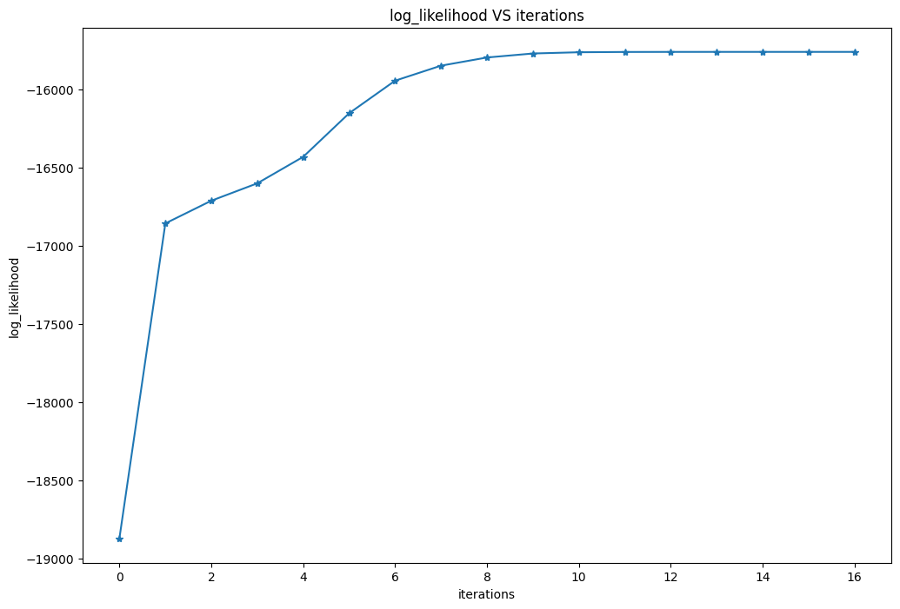{width=50%}

## 3.b
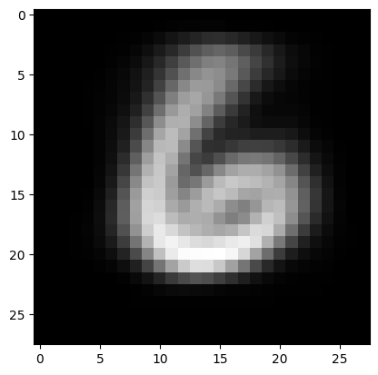{width=50%}
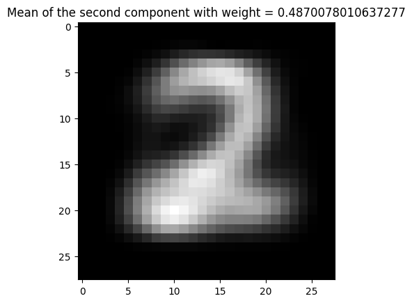{width=50%}

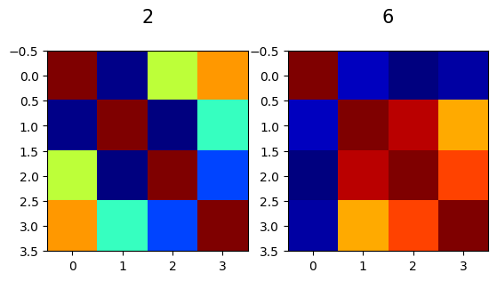{width=50%}

## 3.c

For GMM, the mis-match rate for "2" is 5.81%, and 0.731% for "6". 

For KMeans, the mis-match rate for "2" is 6.20% and 7.72% for "6"

GMM had a lower mis-match rate for both digits, thus had better performance compared to KMeans. 

