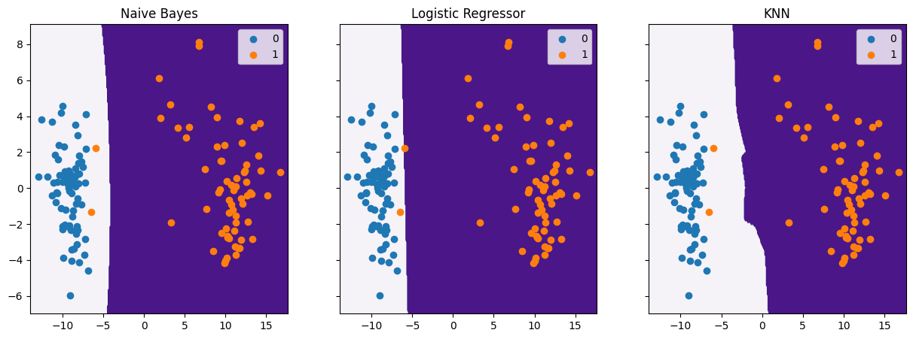

```{r setup, include=FALSE}
knitr::opts_chunk$set(echo = TRUE)
```

# 1. Optimization

## a)

$\nabla l(\theta)= l'(\theta)$

$=\sum_{i=1}^{m}\frac{d}{d\theta}(-log(1+exp(-\theta x^i) ))+\frac{d}{d\theta}((y^i-1)\theta x^i)$

$\nabla l(\theta)=\sum_{i=1}^{m}\left ( \frac{x^iexp(-\theta x^i)}{1+exp(-\theta x^i)}+ (y^i-1)x^i \right )$


## b)

Initialize: $\theta, \gamma,\epsilon$

While: $|\theta^{t+1}-\theta^t| > \epsilon$

Do: $\theta^{t+1}=\theta^t+\gamma \nabla l(\theta)$

## c)

Initialize: $\theta, \gamma,\epsilon,K$

While: $|\theta^{t+1}-\theta^t| > \epsilon$

Do: $\theta^{t+1}=\theta^t+\gamma \sum_{i\subset S_k}\left ( \frac{x^iexp(-\theta x^i)}{1+exp(-\theta x^i)}+ (y^i-1)x^i \right )$


## d)

Given: $\nabla l(\theta)=\sum_{i=1}^{m}\left ( \frac{x^iexp(-\theta x^i)}{1+exp(-\theta x^i)}+ (y^i-1)x^i \right )$

$l''(\theta)=\sum_{i=1}^m\frac{d}{d\theta} \left (\frac{-x^i}{1+exp(-\theta x^i)}\right)=\sum_{i=1}^m \left (\frac{-{x^i}^2}{(1+exp(-\theta x^i)^2}\right)$

The regression problem is concave because the Hessian matrix is less than 0. There is a global minimum and gradient descent will achieve a unique solution when the gradient is at or near 0.

# 2. Naive bayes for spam filtering

## a)

$P(y=0) = \frac{3}{7}; \ \ P(y=1)=\frac{4}{7}$

Message:
  million dollar offer:          [0, 1, 0, 0, 0, 0, 0, 1, 1, 0, 0, 0, 0, 0, 0]
  
  secret offer today:            [1, 1, 0, 0, 0, 0, 1, 0, 0, 0, 0, 0, 0, 0, 0]
  
  secret is secret:              [2, 0, 0, 0, 0, 0, 0, 0, 0, 0, 1, 0, 0, 0, 0]
  
  low price for valued customer: [0, 0, 1, 1, 1, 1, 0, 0, 0, 0, 0, 1, 0, 0, 0]
  
  play secret sports today:      [1, 0, 0, 0, 0, 0, 1, 0, 0, 1, 0, 0, 1, 0, 0]
  
  sports is healthy:             [0, 1, 0, 0, 0, 0, 0, 0, 0, 1, 1, 0, 0, 1, 0]
  
  low price pizza:               [0, 0, 1, 1, 0, 0, 0, 1, 1, 0, 0, 0, 0, 0, 1]
  
  

## b)

$l(\theta)=\sum_{i=1}^{m}\sum_{k=1}^{d}x_k^ilog\theta$

$log(P(x,y))=log \left (P(y)\prod\theta_{c,k}^{x_k^i}  \right )=\sum_{i=1}^m\left( log(P(y)+\sum_{k=1}^n log\theta_{c,k}^{x_k^i} \right)$

Constraint: $\sum_{k=1}^m \theta_{c,k}=1$


$L(P(x,y))=\sum_{i=1}^m\left( log(P(y)+\sum_{k=1}^n log\theta_{c,k}^{x_k^i} \right) + \lambda\sum_{k=1}^n \theta_{c,k}-1$

$\frac{dL}{d\theta} = \sum_{i=1}^m(\frac{1^{x_k^i} }{\theta{c,k}}) + \lambda=0$

$\theta_{c,k}=\frac{-\sum_{i=1}^m1^{x_k^i}}{\lambda}$

Given Constraint: $\sum_{k=1}^m \theta_{c,k}=1=\frac{-\sum_{k=1}^n\sum_{i=1}^m1^{x_k^i}}{\lambda}$

$\lambda=-\sum_{k=1}^n\sum_{i=1}^m1^{x_k^i}$

$\theta_{c,k}=\frac{\sum_{i=1}^m1^{x_k^i}}{\sum_{k=1}^n\sum_{i=1}^m1^{x_k^i}}$

$\theta_{0,1}=\frac{3}{4}$

$\theta_{0,7}=\frac{2}{3}$

$\theta_{1,1}=\frac{1}{4}$

$\theta_{1,15}=\frac{1}{1}=1$

## c)

"today is secret"

$P(x|y=0)=\prod\theta_{c,k}^{x_k}=\theta_{0,1} \theta_{0,7} \theta_{0,11}=\frac{3}{16}$

$P(x|y=1)=\prod\theta_{c,k}^{x_k}=\theta_{1,1} \theta_{1,7} \theta_{1,11}=\frac{1}{16}$

$P(y=0|x)=\frac{P(x|y=0)P(y=0)}{P(x|y=0)P(y=0)+ P(x|y=1)P(y=1)}=\frac{9}{13}$

Since $P(y=0|x)>\frac{1}{2}$, the message is spam.


# 3. Comparing Classifiers

## a)


```{r Q2 a, echo=FALSE}
#df = data.frame()
library(kableExtra)
library(knitr)

#out = c(0.94, 32,32,32,32)
#df$test  = out

df=data.frame(Classifier=c('Naive Bayes','Logistic Regression','KNN'),
              'Testing Accuracy'=c(0.9411,0.9117,0.9411))


kable(df,"latex",align="c", caption="Conditional Sample Mean",label="Q3",escape = FALSE)%>%
    kable_styling(latex_options = "hold_position")

```

Naive Bayes and KNN performed better than Logistic Regression. This may because the data is not linearly separable, and Logistic Regression is a linear classifier. 


## b)


{}

Logistic Regression shows a linear decision boundary while Naive Bayes and KNN both show non-linear boundaries. 


