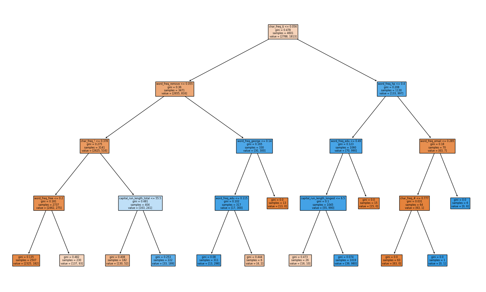

```{r setup, include=FALSE}
knitr::opts_chunk$set(echo = TRUE)
```

# 1. Conceptual Questions

## a)
Data-fit complexity is controlled in a regression tree by a method called pruning. This method grows the tree to the max depth and then removes nodes that do not contribute to the accuracy of the tree. 

Limiting the max depth of the tree is one hyper parameter that can be tuned to limit data over/under fitting. The max depth of a tree is reached when each node contains a single value.  For various tree depths, observing where training accuracy starts to increase and validation accuracy starts to decrease can help give an idea of the optimal tree depth. Another hyperparamter that can be tuned is the minimum number of samples required to be in a node. Adjusting this can simplify or complicate the model.
 
## b)
During training, each tree is trained on a bootstrapped sample. Not all data points are in the sample. The data points left out are the out of bag observations. Then each tree is evaluated on the left out data points. The OOB error is calculated by comparing the predictions on the OOB predictions to the actual outcomes. Observing when the OOB error stabilizes, helps determine the optimal number of trees. Since the OOB data points are within the training data set, and the OOB error is utilized during training, it is a training error. 

## c)
Bagging trains several instances on different sample sets with replacement (bootstrap samples). The results are then averaged. Boosting, on the other hand, trains sequential weak learners and use information from previous learners to improve the results. The result is a weighted sum of the predictions, with better performers being weighed more.

## d)
There are various ways to limit over fit in CART models. This usually occurs when the tree grows too deep and complex. Pruning is one method to prevent over fit over fitting removing noncontributory parts of the tree. Limiting the tree depth or leaf size also limit the tree from growing too large and complex. Observing the validation set during training can help determine when to stop the model training and prevent over fitting. 


# 2. AdaBoost

## a)

{}

Iteration 1:
$D_1(i)= \frac{1}{m}=\frac{1}{8}$ for all i.

$h_1=sign(-x_1,-0.25)$

$\epsilon_1=\sum_{i=1}^{m}D_1(i)\mathbb{I}\{y^i\ne h_1(x^i)\}=\frac{1}{4}$

$\alpha_1 = \frac{1}{2}ln(\frac{1-\epsilon_1}{\epsilon_1})\approx 0.549$


Iteration 2:
$Z_1 = \sum_{i=1}^m D_1(i)e^{-\alpha_1 y^i h_1(x^i)} \approx 0.866$

$D_2(i) = \frac{D_1(i)}{Z_1}e^{-\alpha_1 y^i h_1(x^i)} \approx \left\{ \begin{array}{lcr}  0.083 &  i \neq 5,6  \\  0.250 & i  =5,6\end{array}\right.$

$\epsilon_2 = \sum_{i=1}^m D_2(i) \mathbb{I}\{y^i \neq h_2(x^i)\} \approx 0.167$

$\alpha_2 = \frac 1 2 \ln(\frac{1-\epsilon_2}{\epsilon_2}) \approx 0.805$


Iteration 3:
$Z_2 = \sum_{i=1}^m D_2(i)e^{-\alpha_2 y^i h_2(x^i)} = \sum_{i\in\{1,2\}} D_2(i)e^{\alpha_2} + \sum_{i\notin \{1,2\}} D_2(i)e^{-\alpha_2}  \approx 0.745$ 

$D_3(i) = \frac{D_2(i)}{Z_2}e^{-\alpha_2 y^i h_2(x^i)} \approx \left\{ \begin{array}{lcr}   \approx 0.250 &  i =1,2  \\ \approx 0.150 & i =5,6 \\ \approx 0.050 & i = 3,4,7,8  \end{array}\right.$ 


$h_3(x; w_3, b_3) = sign(h_3(x; -1, 0.75)) = sign( - x_2 + 0.75)$

$\epsilon_3 = \sum_{i=1}^m D_3(i) \mathbb{I}\{y^i \neq h_3 (x^i)\}  =  0.100$

$\alpha_3 = \frac 1 2 \ln(\frac{1-\epsilon_3}{\epsilon_3}) \approx 1.099$

$Z_3 = \sum_{i=1}^m D_3(i)e^{-\alpha_3 y^i h_3(x^i)} = \sum_{i\in\{3,4\}} D_3(i)e^{\alpha_3} + \sum_{i\notin \{3,4\}} D_3(i)e^{-\alpha_3}  \approx 0.60$


## b)
The training error is 0. each data point was correctly classified. AdaBoost performs better than single decision stump because AdaBoost lets future weak learners use weighted dataset from previous weak
learners, thus dividing higher dimension problems into several smaller dimensional problems. 

\begin{table}
\begin{center}
\caption{Values of AdaBoost parameters at each timestep.}
\vspace{0.1in}
\begin{tabular}{|c|c|c|c|c|c|c|c|c|c|c|c|}\hline
t & $\epsilon_t$ & $\alpha_t$ & $Z_t$ & $D_t(1)$ & $D_t(2)$ & $D_t(3)$ & $D_t(4)$ & $D_t(5)$ & $D_t(6)$ & $D_t(7)$ & $D_t(8)$ \\\hline
1 & 0.250 & 0.549 & 0.866 &0.125 &0.125 &0.125 &0.125 & 0.125&0.125 &0.125 & 0.125\\
2 & 0.167 & 0.805 & 0.745 & 0.083 & 0.083 & 0.083 & 0.083 & 0.250 & 0.250 & 0.083 & 0.083 \\
3 & 0.100 & 1.099 & 0.600 & 0.250 & 0.250 & 0.050 & 0.050 & 0.150 & 0.150 & 0.050 & 0.050 \\\hline
\end{tabular}
\end{center}
\end{table}

# 3. Random Forest and one-class SVM

## a)

{}


## b)
The test error of Random Forest Classifier:  3.474%
The test error of Decision Tree Classifier:  6.623%

{}


## c)

{}


Both OOB and test error have a similar increasing trend with number of features and OOB error always having the greater error. 

## d)

By tuning the $\gamma$ hyper parameter, the total misclassification error rate reached 37.71%

# 4. Locally weighted linear regression 

## a)

$\hat{\beta}=argmin(||X\beta-y||+\lambda||\beta||)$

$\hat{\beta} = max_{\beta} \  \sum log(\frac{1}{\sqrt{2\pi\sigma^2}^n}exp(\frac{-(y-X^T\beta)^2}{2\sigma^2}))$

$\hat{\beta} = max_{\beta} \ \sum log(exp(\frac{-(y-X^T\beta)^2}{2\sigma^2}))= argmin \ \sum \frac{(y-X^T\beta)^2}{2\sigma^2} \rightarrow (X\beta-y)^T(X\beta-y)+\lambda||\beta||=argmin(||X\beta-y||+\lambda||\beta||)$

## b)
$\frac{d}{d\beta} (X\beta-y)^T(X\beta-y)+\lambda \beta^TB=0$

$2X^TX\beta -2X^Ty+2\lambda \beta=0$

$X^TX\beta + \lambda\beta=X^Ty$

$\hat{\beta}= (X^TX+\lambda I)^{-1}X^Ty$

## c)
$\mathbb{E}(X^T\hat{\beta})-X^T\beta=\mathbb{E}(X^T(X^TX+\lambda I)^{-1}X^Ty)-X^T\beta$

$\mathbb{E}(X^T(X^TX+\lambda I)^{-1}X^TX\beta)-X^T\beta=\mathbb{E}(X^T(X^TX+\lambda I)^{-1}(X^TX+\lambda I-\lambda I)\beta)-X^T\beta$

$\mathbb{E}(X^T(I-\lambda(X^TX+\lambda I)^{-1})\beta)-X^T\beta=X^T(\beta-\beta \lambda (X^TX+\lambda I)^{-1})-X^T\beta$

$\therefore \ Bias: \ -X^T\beta\lambda(X^T\lambda + \lambda I)^{-1}$

## d)
$Var[\hat{\beta}]=Var[(X^TX+\lambda I)^{-1} X^T y]=(X^TX+\lambda I)^{-1}X^T(X^TX+\lambda I)^{-1}X^TVar[y]$


## e)
{}
## f)
Changing the test sample to x = 1.5 did not change the results of the MSE vs lambda plot.

{}


